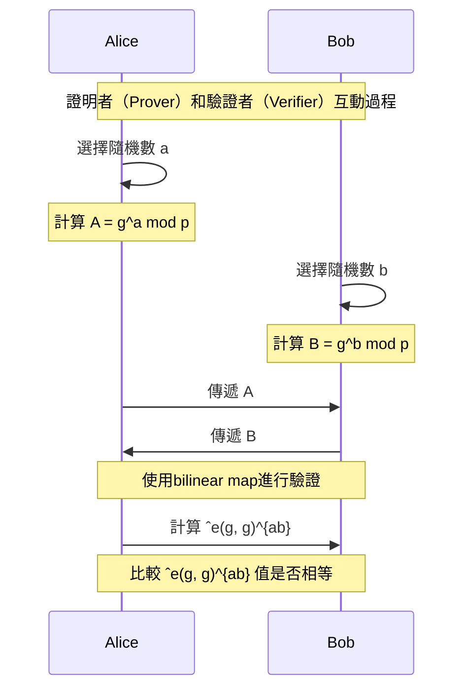

# 零知識證明在身份驗證中的應用

在當今的數字時代，保護個人隱私和數據安全變得至關重要。傳統的身份驗證方法通常需要揭示敏感信息，而這引發了對個人隱私的擔憂。然而，一種被稱為「零知識證明」的創新技術正在解決這個問題，為身份驗證提供了更好的隱私保護。

## 什麼是零知識證明？

零知識證明（Zero-Knowledge Proofs）是一種加密和安全協議的概念，用於證明某個陳述的真實性，同時不揭示與該陳述相關的具體信息。在零知識證明中，證明者（Prover）希望向驗證者（Verifier）證明某個語句的真實性，但同時不希望揭示任何關於該語句的具體信息。

零知識證明具有以下特點：

- 真實性：證明者能夠以高概率向驗證者展示陳述的真實性，即說明該陳述為真。
- 完整性：如果陳述為假，則試圖欺騙的證明者無法以高概率成功地向驗證者提供證明。
- 零知識性：證明過程不泄露任何關於陳述本身的附加信息。驗證者僅獲得關於陳述真偽的信息，而無需了解如何證明。

## 在身份驗證中的應用

零知識證明在身份驗證中具有重要的應用。讓我們通過一個示例來了解在身份驗證場景中如何應用零知識證明。

### 零知識證明的身份驗證示例

在這個示例中，Alice和Bob希望進行身份驗證，而不需要相互揭示具體的密碼。他們都知道一個大素數p和其生成元g。接下來，他們遵循以下步驟進行身份驗證：

1. Alice選擇隨機數a，Bob選擇隨機數b。
2. Alice計算A = $g^a\ mod\ p$，Bob計算B = $g^b\ mod\ p$。
3. Alice 將 A 傳遞給 Bob，Bob 將 B 傳遞給 Alice。
4. 使用 bilinear map 進行驗證，Alice 和 Bob 計算 $ˆe(g, g)^{ab}$。
5. 比較計算得到的 $ˆe(g, g)^{ab}$ 值是否相等。

通過這個身份驗證示例，Alice和Bob可以確定對方知道正確的隨機數a和b值，，而不揭示具體的密碼本身。這樣可以實現零知識的身份驗證，確保個人隱私的保護。

## 結論

零知識證明提供了一種強大的工具，可在保護隱私的同時實現身份驗證。它使得證明者可以證明某個陳述的真實性，同時不揭示具體的信息。在身份驗證場景中，零知識證明可以確保敏感信息得到保護，同時實現安全的驗證過程。這種創新技術將為我們帶來更安全、更隱私的數字世界。